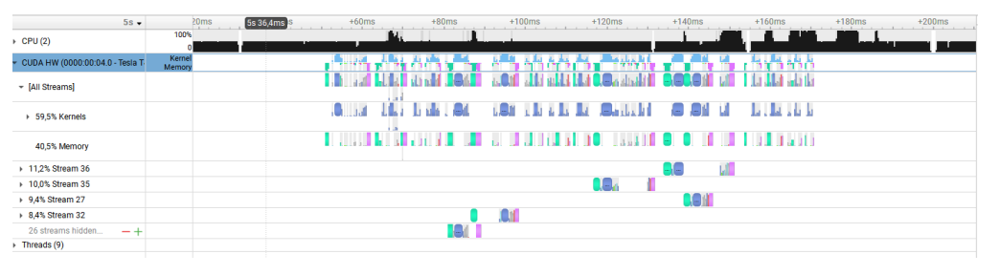
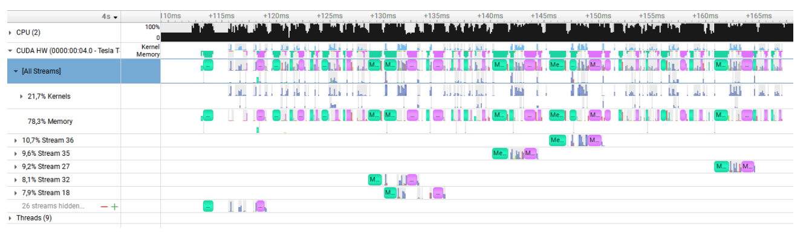

<a id="readme-top"></a>
# GPU-implemented Corrupt Image Correction

<!-- ABOUT THE PROJECT -->
## About The Project

Here is a folder of corrumpted images : https://cloud.lrde.epita.fr/s/XYPimokPGSQrM35

The corruption is as follows :
* Garbage data in the form of lines of “-27” have been introduced in the image</br>
* Pixels got their values modified : 0 : +1 ; 1 : -5 ; 2 : +3 ; 3 : -8 ; 4 : +1 ; 5 : -5; 6 : +3; 7 : -8…</br>
* All images have awful colors and should be histogram equalized

We were given a code solution in C++ but it is super slow (CPU folk’s issues)</br>

The goal of this project was to implement in CUDA the given algorithm to optimise it's execution time so it runs in real time. We have implemented two versions to compare results :
* Kernel version (hand writted)
* Modern/industrial CUDA

### Kernel Version

The goal of this version is to implement the solution in CUDA without any modern libraries : hand written Kernels and functions (histogram, reduce, scan).

### Industrial Version

The goal of this version is to implement the solution with all the modern libraries and compare with the Kernel version.

We have implemented the solution using these CUDA libraries : 
* Thurst
* CUB
* RMM
* Raft

### Results

We were able to benchmark with Nsight System thanks to Google Colab.

Here is the benchmark of the kernel version. 

<br />
<div align="center">
  <a href="https://github.com/Auxemite/GPGPUA/">
     <!-- width="80" height="80"> -->
  </a>
</div>

Processing all the images took 120 ms on Google Colab machines. In the analysis report, we
can see that the kernel that took the longest time was the Decoupled Look-Back Scan.

Here is the benchmark of the industrial version. 

<br />
<div align="center">
  <a href="https://github.com/Auxemite/GPGPUA/">
     <!-- width="80" height="80"> -->
  </a>
</div>

We can see that the proportion of computing time coming from the kernels has been halved by using library kernels. Processing all the images takes 60 ms with this version. It is therefore almost twice as fast.

The detailed report is on the pdf "Rapport_projet.pdf" (in French)

<p align="right">(<a href="#readme-top">back to top</a>)</p>

## Getting Started

### Requirements to build

* [Cuda Toolkit](https://developer.nvidia.com/cuda-downloads)
* C++ compiler ([g++](https://gcc.gnu.org/) for linux,  [MSVC](https://visualstudio.microsoft.com/downloads/) for Windows)
* [GPU supported by CUDA](https://en.wikipedia.org/wiki/CUDA#GPUs_supported)
* [CMake](https://cmake.org/download/)

### Build

!! If you are not on the OpenStack, I strongly advise you to remove the first lines in the CmakeLists.txt !!

- To build, execute the following commands :

```bash
mkdir build && cd build
cmake ..
make -j
```

* By default the program **will run in release**. To build in **debug**, do:

```bash
cmake -DCMAKE_BUILD_TYPE=Debug ..
```

### Run :

```bash
cd build
```
Run the 3 versions of the algorithm
CPU version : 
```
./main cpu
```
GPU Kernel version :
```
./main kernel
```
GPU Industrial version :
```
./main indus
```

<!-- AUTHORS -->
## Authors
Nicolas Regnier Vigouroux<br />
Ernest Bardon<br />
Gregoire Vest
